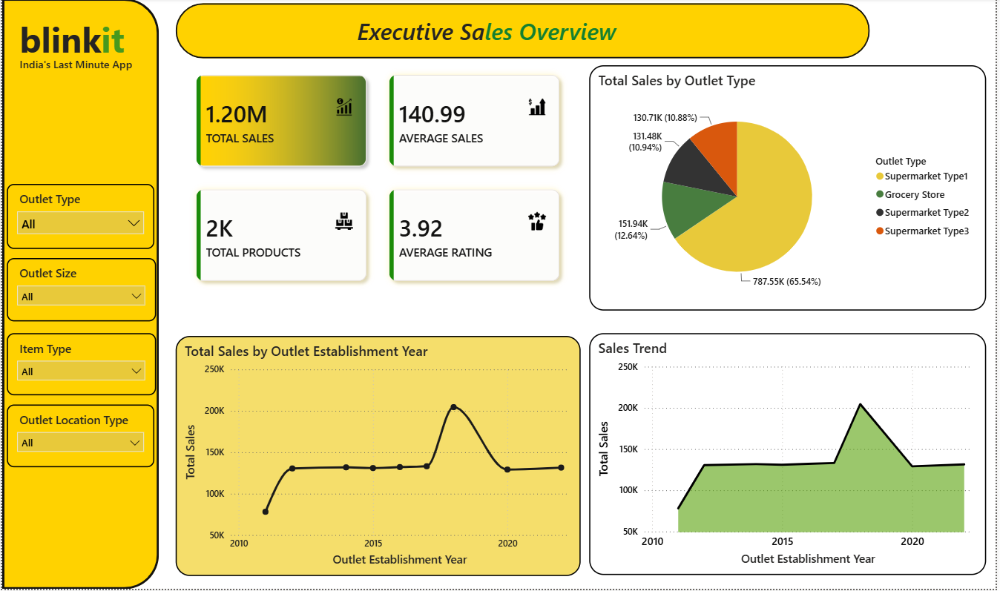
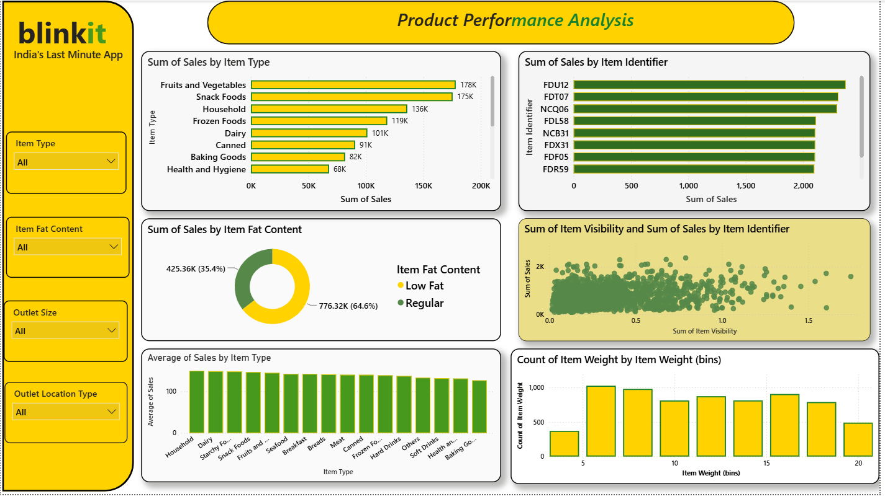
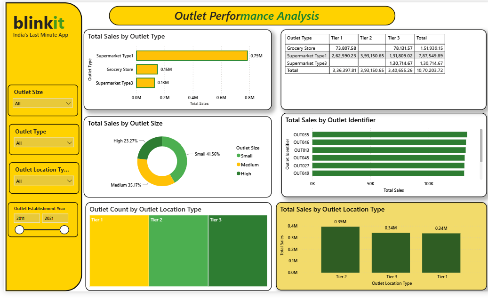
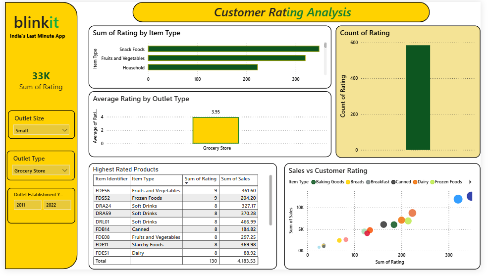
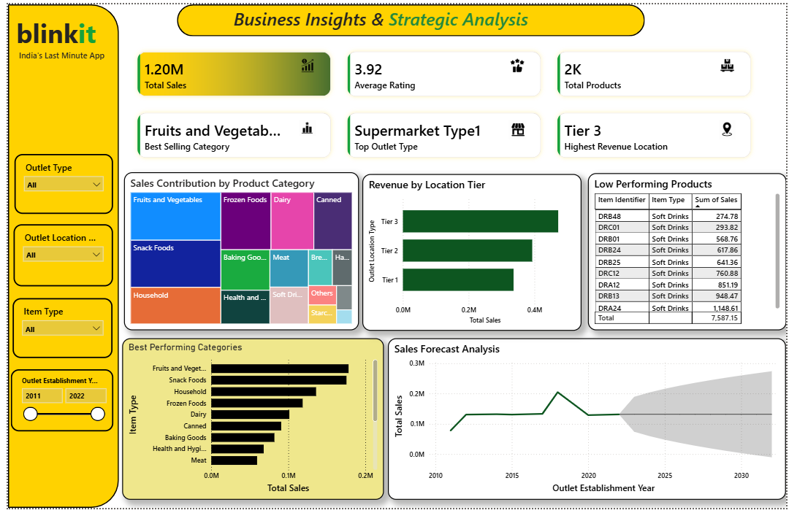

# BlinkIT-Sales-Analysis-PowerBI
Interactive Power BI Dashboard for BlinkIT Grocery Sales Analysis using Power Query and DAX.

## 🎯 Objectives

- Analyze BlinkIT grocery sales data to understand overall business performance.
- Monitor key performance indicators (KPIs) such as Total Sales, Average Sales, Total Products, and Customer Ratings.
- Evaluate product performance by identifying top-selling and low-performing products.
- Analyze outlet performance based on outlet type, size, and location tier.
- Understand customer satisfaction through rating analysis.
- Generate actionable business insights to support data-driven decision-making.
- Design an interactive and user-friendly dashboard using Microsoft Power BI.
- Demonstrate the use of Power Query, DAX, and data visualization techniques for business intelligence.

- ## 🛠️ Tools & Technologies

- Microsoft Power BI
- Power Query
- DAX (Data Analysis Expressions)
- Microsoft Excel
- Data Visualization
- Business Intelligence
- Data Analytics

## 📂 Dataset Used

- **Dataset:** [BlinkIT Grocery Dataset](https://www.kaggle.com/datasets/arunkumaroraon/blinkit-grocery-dataset)

- ## 🔄 Project Workflow

1. Data Collection
2. Data Cleaning using Power Query
3. Data Transformation
4. Data Modeling
5. DAX Measure Creation
6. KPI Development
7. Dashboard Design
8. Interactive Visualization
9. Business Insights Generation
10. Strategic Recommendation

## 📊 Dashboard Overview

### 📄 Dashboard 1 – Executive Sales Overview

- Total Sales KPI
- Average Sales KPI
- Total Products KPI
- Average Customer Rating KPI
- Sales by Outlet Establishment Year
- Sales Distribution by Outlet Type
- Overall Sales Trend

### 📄 Dashboard 2 – Product Performance Analysis

- Sales by Item Type
- Top 10 Selling Products
- Sales by Fat Content
- Item Visibility vs Sales
- Average Sales by Product Category
- Product Weight Distribution

### 📄 Dashboard 3 – Outlet Performance Analysis

- Sales by Outlet Type
- Sales by Outlet Size
- Sales by Outlet Location Type
- Top Performing Outlets
- Outlet Count by Location Tier
- Outlet Performance Matrix

### 📄 Dashboard 4 – Customer Rating Analysis

- Average Customer Rating
- Rating by Product Category
- Rating Distribution
- Sales vs Rating
- Highest Rated Products
- Average Rating by Outlet Type

### 📄 Dashboard 5 – Business Insights & Strategic Analysis

- Sales Contribution by Product Category
- Revenue by Location Tier
- Best Performing Product Categories
- Bottom 10 Performing Products
- Sales Trend Analysis
- Business Recommendation Dashboard
- 
  ## 📈 Key Performance Indicators (KPIs)

- Total Sales
- Average Sales
- Total Products
- Average Customer Rating
- Best Selling Product Category
- Top Performing Outlet Type
- Highest Revenue Location Tier

  ## ❓ Business Questions Addressed

- What is the overall sales performance of BlinkIT?
- Which product categories and products generate the highest and lowest sales?
- Which outlet types, outlet sizes, and location tiers contribute the most revenue?
- How do customer ratings vary across different products and outlet types?
- What are the key factors influencing sales performance?
- Which products require promotional efforts or inventory optimization?
- Which outlet locations offer the greatest business growth opportunities?
- How has sales performance changed over time?
- Which KPIs are most important for monitoring business performance?
- What insights can help improve profitability and customer satisfaction?

- ## 💡 Key Business Insights

- Identified the highest revenue-generating product categories.
- Compared sales performance across different outlet types and location tiers.
- Identified the top-performing outlets contributing to overall revenue.
- Highlighted low-performing products that require business attention.
- Analyzed customer ratings to evaluate customer satisfaction.
- Tracked sales trends to understand business growth over time.
- Developed KPI-driven dashboards for executive decision-making.
- Enabled interactive filtering for detailed business analysis.
- Transformed raw sales data into actionable business intelligence.
- Supported strategic decision-making through data-driven insights.
## 📷 Dashboard Screenshots

### Executive Sales Overview

### Product Performance Analysis

### Outlet Performance Analysis

### Customer Rating Analysis

### Business Insights & Strategic Analysis

